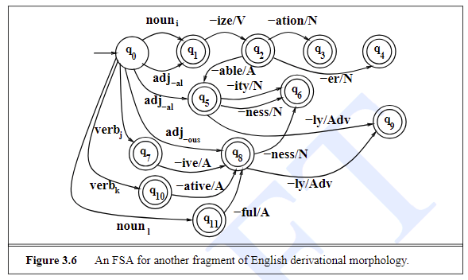

# Week 1 

* Chapter 1:
	* Read completely (level R)

* Chapter 2:
	* Read completely (level RU)
	* You have to be able to **understand and build regular expressions** for given tasks
	* You have to be able to **understand and build an FSA**

* Chapter 3:
	* Read at level RU: Intro, 3.1, 3.2, 3.8, 3.9, Summary
	* Read at level R: Notes

## Exercises

* Do all five crosswords under http://regexcrossword.com/challenges/intermediate/puzzles/1
* Attempt to do http://regexcrossword.com/challenges/experienced/puzzles/4 and http://regexcrossword.com/challenges/experienced/puzzles/5
* Do exercise 3.1 (“Give examples…”).

### Regex Crossword Puzzles - Intermediate

| | UB\|IE\|AW | [TUBE]* | [BORF]. |
| ------------- | ------------- | ------------- | ------------- |
| **[NOTAD]*** | A | T | O |
| **WEL\|BAL\|EAR** | W  | E | L |

| | \[BQW\](PR\|LE) | [RANK]+ |
| ------------- | ------------- | ------------- |
| **[AWE]+** | W | A |
| **[ALP]+K** | L | K |
| **(PR\|ER\|EP)** | E | R |

| | .(.)\1 | .*[WAY]+ | [RAM].[OH] |
| ------------- | ------------- | ------------- | ------------- |
| **CAT\|FOR\|FAT** | F | O | R |
| **RY\|TY\\-** | T | Y | - |
| **[TOWEL]*** | T | W | O |

| | [JUNDT]* | APA\|OPI\|OLK | (NA\|FE\|HE)[CV] |
| ------------- | ------------- | ------------- | ------------- |
| **[DEF][MNO]*** | D | O | N |
| **[^DJNU]P[ABC]** | T | P | A |
| **[ICAN]*** | N | I | C |

| | \[^NRU\](NO\|ON) | (D\|FU\|UF)+ | (FO\|A\|R)* | (N\|A)* |
| ------------- | ------------- | ------------- | ------------- | ------------- |
| **[RUNT]**** | T | U | R | N |
| **O.*[HAT]** | O | F | F | A |
| __(.)*DO\1__ | N | D | O | N |

### Regex Crossword Puzzles - Experienced

**Puzzle 4**

| | (!!\|\?!\|;\?)\*\? | [<!?\*#>]* | [?\*!].\?[!<\*]\* | (.)[?#]\1\?\1 | [<?>][\[!]\*[?\|#] |
| ------------- | ------------- | ------------- | ------------- | ------------- | ------------- |
| **[#?]!\*[:?;]** | ? | ! | ! | ! | ? |
| **(.)([;?])\1\2\1** | ! | ? | ! | ? | ! |
| **["!"]\*\?!\*#?** | ! | ! | ? | ! | ! |
| **.[;?][>!?]*** | ! | ? | ! | ? | ! |
| **(.)[;!"]\*!\1** | ? | ! | ! | ! | ? |

**Puzzle 5**

| | [RUTH]\*(OE\|EO)[RB]\* | (BG\|ON\|KK)+[RIF]+ | (MN\|BO\|FI)[EU]{2,} | (KT\|AL\|ET)+G | \[OH](PR\|AX\|TR)+ |
| ------------- | ------------- | ------------- | ------------- | ------------- | ------------- |
| **\[IT](O)\*(BE\|AD)\*\1** | T | O | B | E | O |
| **[NORMAL]+T{2}** | R | N | O | T | T |
| **.\*(XA\|BE).*** | O | B | E | A | R |
| **(EG\|UL){2}[ALF]*** | E | G | U | L | A |
| **[REQ]*(G\|P)(.)+** | R | R | E | G | X |

### Exercise 3.1

Give examples of each of the noun and verb classes in Fig. 3.6, and find some exceptions to the rules.

